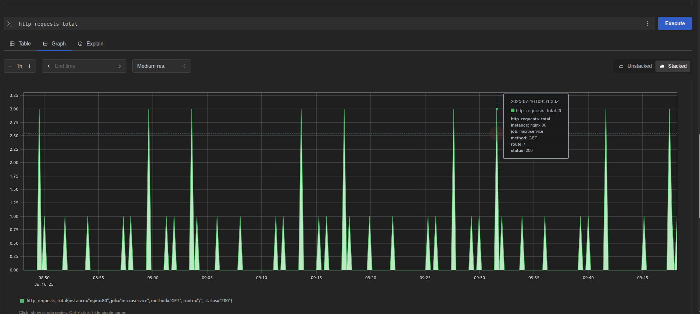
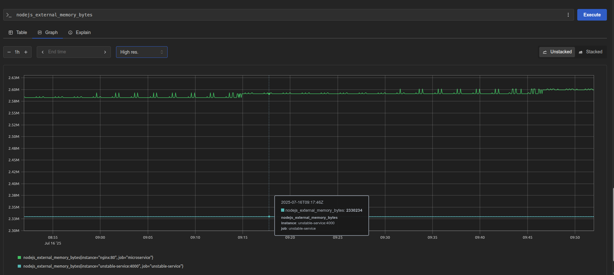
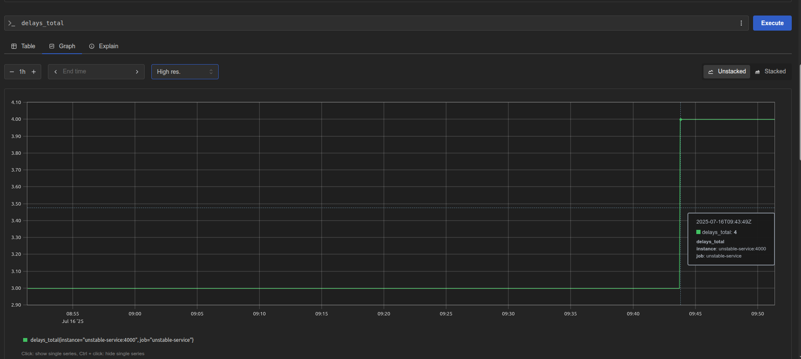
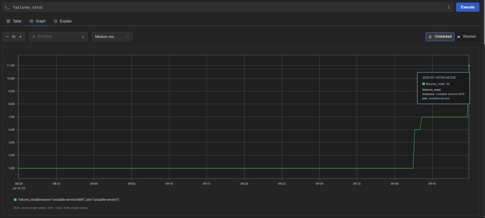
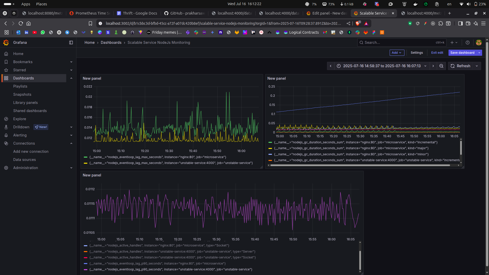
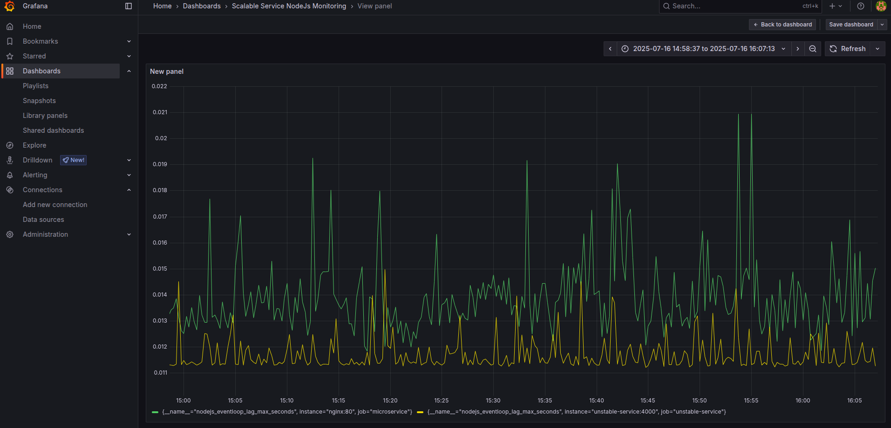
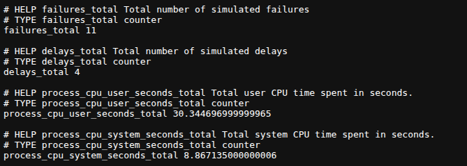

# 🚀 Node.js Scalable + Resilient Microservice System

This project demonstrates a **scalable and resilient Node.js system** that uses clustering, NGINX load balancing, Redis-based data sharing, and retry/fallback and full observability with Prometheus and Grafana logic when dealing with unstable external services.

---

## 📦 Features

- **Node.js** (Express)
- **NGINX** (Load Balancer)
- **Redis** (Sharded storage)
- **Prometheus** (Monitoring)
- **Grafana** (Visualization)
- **Docker + Docker Compose**
- **Cluster module for horizontal scaling**
- **Retry with fallback** for resilience
- **Metrics endpoint** for observability

---

## 🧱 Architecture

           ┌────────────┐
           │  Client    │
           └────┬───────┘
                │
          ┌─────▼─────┐
          │   NGINX   │
          └────┬──────┘
       ┌───────┼────────┐

┌───▼───┐ ┌──▼────┐ ┌────────────┐
│ app1 │ │ app2 │ │ unstable.js│
└───────┘ └───────┘ └────────────┘
│ │
┌─▼─────────▼─┐
│ Redis DB │
└─────────────┘
│
┌─▼─────────▼─┐
│Prometheus │
└─────────────┘
│
┌───▼────┐
│ Grafana│
└────────┘

---

## 📦 Project Structure

```
.
├── docker-compose.yml
├── nginx/
│ └── default.conf
├── prometheus/
│ └── prometheus.yml
├── grafana/
│ └── provisioning/
│ ├── dashboards/
│ └── datasources/
├── services/
│ ├── app.js
│ ├── externalService.js
│ ├── shardedStore.js
│ ├── unstable.js
│ ├── Dockerfile
├── screenshots/
│ ├── grafana-dashboard.png
│ ├── grafana-cpu-mem.png
│ └── prometheus-query.png
└── README.md
```

---

## 📊 Observability (Grafana + Prometheus)

Our system integrates **Prometheus** for scraping runtime metrics and **Grafana** for visualization.

### 🔍 Grafana Dashboard

- Track CPU usage, memory, uptime, request volume, and failures in real-time
- Pre-provisioned dashboards load automatically

> Visit: `http://localhost:3000`
>
> Credentials: `admin / admin`

**Sample Dashboards:**

| Dashboard                                 | Screenshot                                                                                           |
| ----------------------------------------- | ---------------------------------------------------------------------------------------------------- |
| 📈 Http Total Requests                    |                                         |
| 🧠 Unstable service external memory bytes |  |
| 🧠 Micro service external memory bytes    |          |
| 📡 Delays Total                           |                                                       |
| 📡 Failure Total                          |                                                    |

---

---

## 🚀 Setup Instructions

### 🛠 Prerequisites

- [Docker](https://www.docker.com/)
- [Docker Compose](https://docs.docker.com/compose/)

### ▶ Start the System

```bash
docker-compose up --build
```

### ⛔ Stop the System

```bash
docker-compose down
```

---

## 🌐 Endpoints

### 1. `GET /`

Fetch external data and store it via sharding. Response includes:

```json
{
  "instance": 18722,
  "id": 1234,
  "data": {
    "timestamp": 1752490124092,
    "message": "External service OK"
  }
}
```

### 2. `GET /data/:id`

Fetch previously stored data by ID:

```bash
curl http://localhost:8080/data/1234
```

Response:

```json
{
  "id": 1234,
  "data": {
    "timestamp": 1752490124092,
    "message": "External service OK"
  }
}
```

### 3. `GET /metrics`

Returns simple runtime metrics:

```bash
curl http://localhost:8080/metrics
```

Example output:

```
uptime_seconds 123.456
requests_total 27
requests_failed 3
redis_keys_total 8
```

---

## ⚙️ Scalability Techniques

### 1. 🔁 Load Balancing

- Implemented using **NGINX**.
- NGINX forwards traffic to `app1` and `app2` instances.

### 2. ⚡ Horizontal Scaling

- Node.js **cluster** module used to spawn workers equal to CPU count.
- Requests are distributed among worker processes.

### 3. 🧱 Sharding (via Redis)

- Data is stored in Redis shards based on ID hash.
- Scalable design simulating partitioned data storage.

---

## 🛡️ Resilience Pattern

### ✅ Retry with Fallback

- On request to external service:
  - Retries up to 3 times
  - If still failing, returns a fallback:

```json
{
  "message": "Fallback response"
}
```

---

## 💥 Failure & Recovery Simulation

### 🔁 Retry + Fallback

- Simulated via `externalService.js` calling `unstable-service`
- If it fails or delays too long:
  - Retry logic triggers
  - Fallback is returned

### 🧪 Test Failure

**Option 1:** Modify `unstable.js` failure rate

```js
if (Math.random() < 0.8) { // 80% failure
```

**Option 2:** Stop service

```bash
docker-compose stop unstable-service
```

**Then:**

```bash
curl http://localhost:8080/
```

Response:

```json
{
  "data": {
    "message": "Fallback response"
  }
}
```

### 🔄 Test Recovery

```bash
docker-compose start unstable-service
```

Retry request:

```bash
curl http://localhost:8080/
```

You’ll now get real external data again.

---

## 🐳 Docker Services

| Service          | Description                       | Port  |
| ---------------- | --------------------------------- | ----- |
| app1 / app2      | Node.js services (clustered)      | 3000  |
| nginx            | Load balancer                     | 8080  |
| redis1 / redis2  | Redis shards                      | 6379+ |
| unstable-service | Mock service with random failures | 4000  |
| prometheus       | Metrics scraper                   | 9090  |
| grafana          | Metrics dashboard                 | 3000  |

---

## 🔧 Useful Commands

### Check all containers

```bash
docker ps
```

### Logs for `app1`

```bash
docker-compose logs app1
```

### Shell into a service container

```bash
docker exec -it <container_name> /bin/sh
```

---

## 📈 Prometheus Metrics

### Prometheus scrapes each Node.js service on /metrics.

Sample:

```bash
HELP uptime_seconds Total uptime in seconds
TYPE uptime_seconds counter
uptime_seconds 104.23

HELP requests_total Total number of requests
TYPE requests_total counter
requests_total 154

```

You can test directly:

```bash
curl http://localhost:8080/metrics
```

## Grafana Monitoring Dashboard Metrics



You can test that on

```bash
curl http://localhost:3002
```

### ✅ 1. Access Grafana

- URL: [http://localhost:3001](http://localhost:3001)
- **Default credentials:**
  - **Username:** `admin`
  - **Password:** `admin`

> 🔐 You'll be prompted to change the password on first login.

---

### ✅ 2. Add Prometheus as a Data Source

1. Open Grafana UI → Click ⚙️ **Settings** → **Data Sources**
2. Click **"Add data source"**
3. Choose **Prometheus**
4. Set URL to: http://prometheus:9090
5. Click **"Save & Test"**

---

### ✅ 3. Create a Dashboard

1. Click **“+” → Dashboard → Add new panel**
2. Select **Prometheus** as the data source
3. Use the following metric queries:

#### 🟥 Failures

failures_total

#### 🟨 Delays

delays_total

4. Choose your visualization type:

   - **Stat**
   - **Gauge**
   - **Time series**
   - **Bar gauge**

5. Click **Apply**, then **Save dashboard**
6. Give it a name like:

---

### 🖼️ Example Panel Setup

| Panel Title    | Query            | Visualization |
| -------------- | ---------------- | ------------- |
| Total Failures | `failures_total` | Stat / Gauge  |
| Total Delays   | `delays_total`   | Stat / Gauge  |

---

### 📸 Sample Screenshot

> 

## ✅ Example Workflow

```bash
# 1. Call main endpoint
curl http://localhost:8080/

# 2. Get data by ID
curl http://localhost:8080/data/1234

# 3. Get metrics keys and data that can be used as query on the grafana as well as Prometheus dashboard
curl http://localhost:8080/metrics

#4. Prometheus Dashboard UI
curl http://localhost:9090

### Example queries
requests_total
requests_failed
rate(uptime_seconds[1m])

#5. Open Grafana
open http://localhost:3000

#6.Simulate a failure
curl http://localhost:4000/data?fail=true

#7. Simulate a delay
curl http://localhost:4000/data?delay=true

#8. Unstable Service Metrics data
[]

```

---

## 📈 Bonus Features

- [✅] Load balanced with NGIN✅
- [✅] Clustered Node.js workers
- [✅] Redis-based sharded storage
- [✅] Fallback + retry mechanism
- [✅] Monitoring via `/metrics`
- [✅] Prometheus-integrated metrics
- [✅] Grafana dashboards pre-provisioned
- [✅] Dockerize with Docker Compose

---
